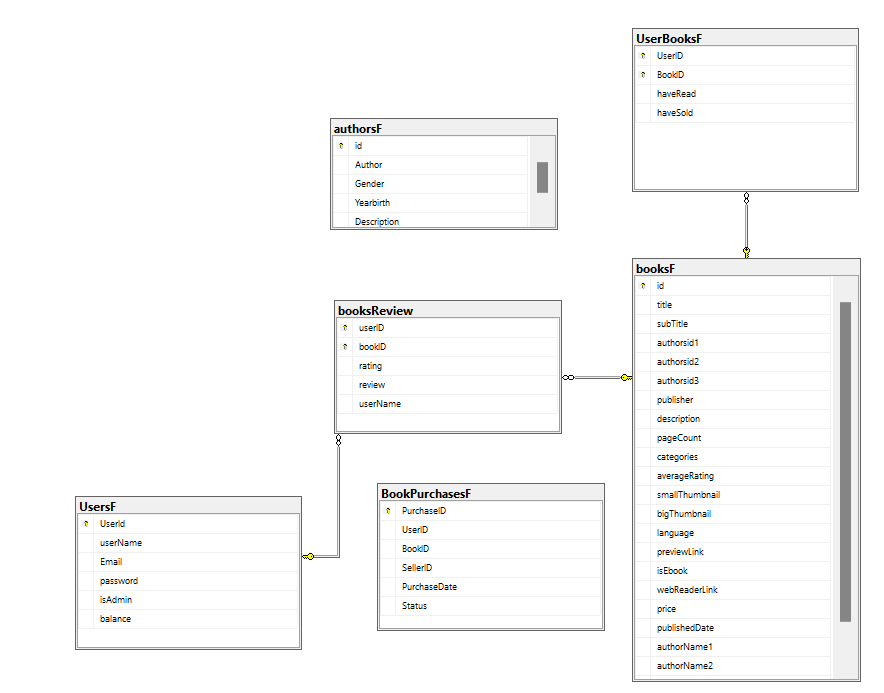

# 📚 Online Library

**Library Web** is a full-stack digital library and bookstore platform that enables users to search, buy, sell, and manage books online. It offers a seamless reading and shopping experience with an intuitive interface and robust backend integration.

## 🌟 Features

- 🔍 **Book Search**: Browse books using titles, keywords, or author names.
- 📚 **Personal Library**: Add books to "Want to Read", "Have Read", and "Purchased" sections.
- 🔄 **Book Trading**: Buy and sell physical books directly between users.
- 👤 **Author Profiles**: Explore detailed information about book authors.
- 📈 **Admin Dashboard**: Manage users, books, and transactions with analytics insights.
- 🔒 **Secure Transactions**: Ensures user data protection and smooth purchasing flow.

## 🧰 Tech Stack

- **Frontend**: HTML, CSS, JavaScript (Responsive & Mobile-Friendly Design)
- **Backend**: ASP.NET Core (C#)
- **Database**: SQL Server / MySQL
- **APIs**: Google Books API Integration
- **Architecture**: RESTful API

## 🛠️ Architecture Overview

- **Frontend** connects to the backend via REST APIs.
- **Backend** handles user authentication, book data, transactions, and analytics.
- **Google Books API** is used to fetch book metadata for catalog population.
- **Admin Interface** offers privileged access to user/book management and statistics.

## 👤 Roles

- **User**: Browse books, manage a personal library, buy/sell books.
- **Admin**: Manage users, track transactions, analyze engagement.
